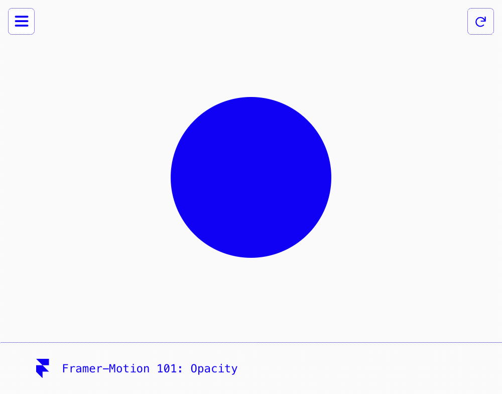
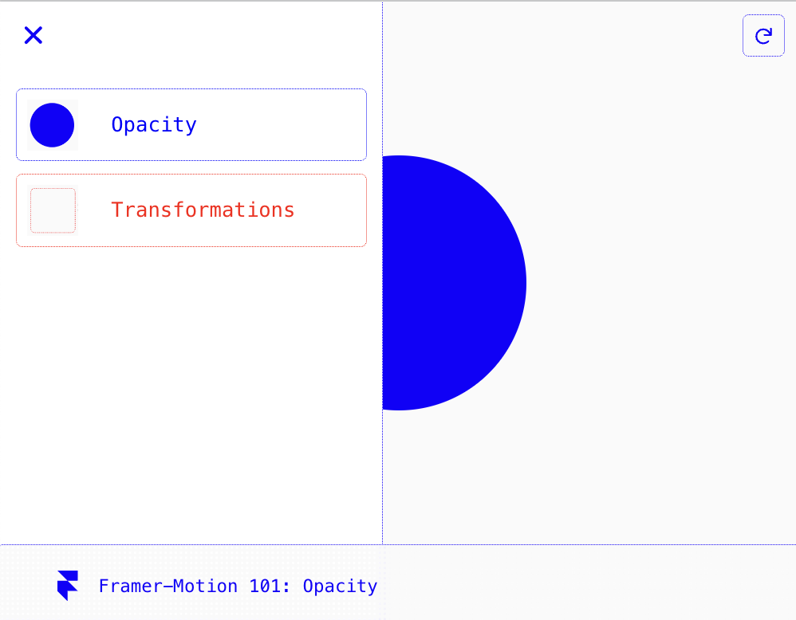
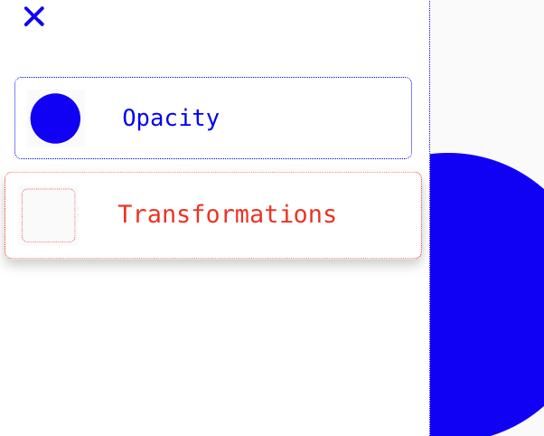
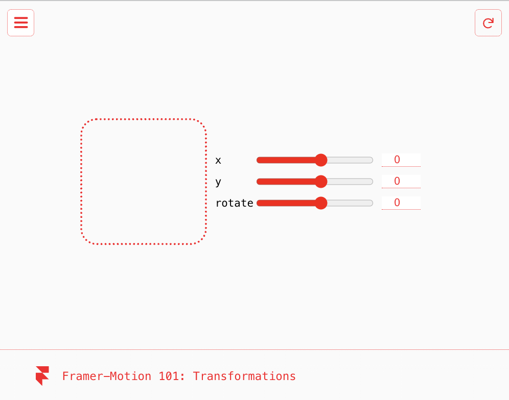

<h1 >🖼️ Framer-Motion 101 ⚛️</h1>

A repo dedicated to learning [framer-motion](https://www.framer.com/motion/) with react!

## Usage 🎬

<div style="display: flex; flex-wrap: wrap; justify-content: center; align-items: center; gap: 4px;">




</div>

## Installation 🛠️

Install this application locally to run in your own development environment

```
git clone https://github.com/llevasseur/framer-motion.git

cd framer-motion/client

npm i

npm run dev

Open http://localhost:5173/ in your prefered browser
```

## Future Features 💡

- Home Page
- Nav button scale on hover
- Hamburger animation on hover
- Spring Hover component
- Debug Transformation delay
- 404 Not Found Page
